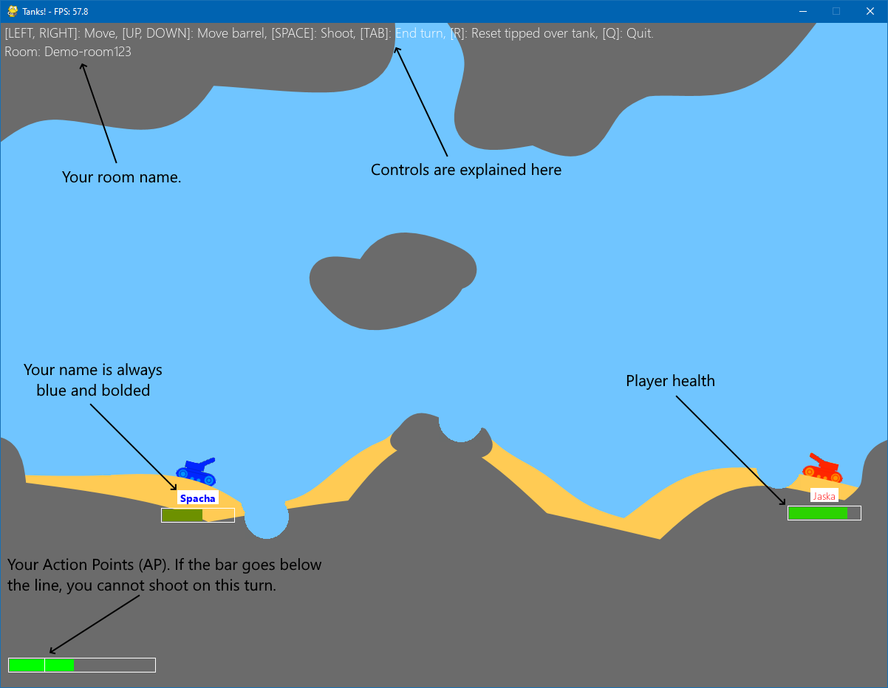

# Tanks
Simple 2D tanks game in Python.

# Requirements

The requirements are listed in the `requirements.txt` file, which can be used to install them.
* Python 3.10+
* websockets, janus, pygame, pymunk

The libraries used are cross-platform, but the software is mainly developed for **Windows**, I suggest using that.

# Installation

```shell
$ pip install -r requirements.txt
```

# Usage

## 1. Start the server

To start playing, you have to first start the server. You can change the server address and port from `server.py` and `client.py`. The server can be used locally on your machine (e.g. `localhost`) or over LAN (e.g. `192.168.1.123`).

```shell
# Run server (change host IP and port if necessary)
$ python server.py
```

## 2. Join the game

If the server starts without problems, you can join to it using the client. You can connect multiple clients on a game (the limit is 2 players per room by default).

Before connecting, the client asks for room name, which can be anything you want for a new room. To connect to existing room, simply use an existing room name. The client also asks "nickname", which is used to tell players apart in a game. This can also be anything you want.

```shell
# Run client (change host IP and port if necessary)
$ python client.py
```

## 3. Play!

The game is very simple. The figure below shows the controls and mechanics of the game.

Action points limit movement, shooting and other actions per turn and is reset in the beginning of a new turn.


